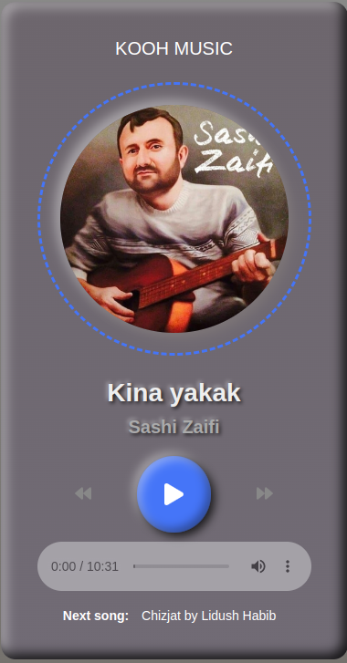
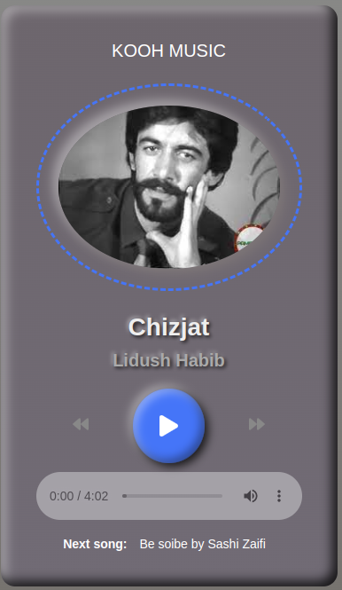

# React Music Player

This is a simple music player built using React. It allows users to play, pause, skip, and shuffle tracks. 

## Screenshots

## Features

- Play/pause button
- Next/previous track button
- Shuffle button
- Volume control slider
- Track progress slider

## Installation

1. Clone the repository: `git clone https://github.com/Alibakhshov/KoohMusic`
2. Install dependencies: `npm install`
3. Start the app: `npm start`

## Usage

1. Add your music files to the `public/music` folder.
2. Update the `src/App.js` file with the details of your music files.
3. Start the app: `npm start`

## Contributions

Anyone can contribute to this repository. If you want to contribute, please follow the steps below:

1. Fork this repository
2. Clone the forked repository
3. Create a new branch
4. Make changes to the code
5. Commit the changes
6. Push the changes to the forked repository
7. Create a pull request
8. Wait for the pull request to be merged
9. Repeat steps 1-8

<a href="#top">back to top</a>

